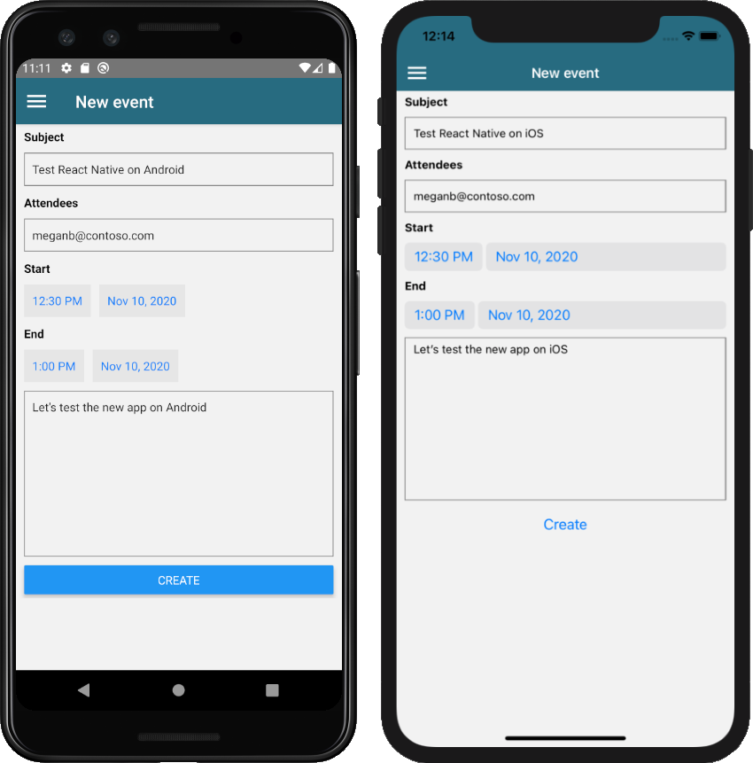

<!-- markdownlint-disable MD002 MD041 -->

In this section you will add the ability to create events on the user's calendar.

## Create the new event screen

1. Open **./graph/GraphManager.ts** and add the following function to the `GraphManager` class.

    :::code language="typescript" source="../demo/GraphTutorial/graph/GraphManager.ts" id="CreateEventSnippet":::

    This function uses the Graph SDK to create a new event.

1. Create a new file in the **./screens** named **NewEventScreen.tsx** and add the following code.

    :::code language="typescript" source="../demo/GraphTutorial/screens/NewEventScreen.tsx" id="NewEventScreenSnippet":::

    Consider what the `createEvent` function does. It creates a `MicrosoftGraph.Event` object using the values from the form, then passes that object to the `GraphManager.createEvent` function.

1. Open **./menus/DrawerMenu.tsx** and add the following `import` statement at the top of the file.

    ```typescript
    import NewEventScreen from '../screens/NewEventScreen';
    ```

1. Add the following code inside the `<Drawer.Navigator>` element, just above the `</Drawer.Navigator>` line.

    ```typescript
    {userLoaded && (
      <Drawer.Screen
        name='NewEvent'
        component={NewEventScreen}
        options={{drawerLabel: 'New event'}}
      />
    )}
    ```

1. Save your changes and restart or refresh the app. Select the **New event** option on the menu to get to the new event form.

1. Fill in the form and select **Create**.

    
